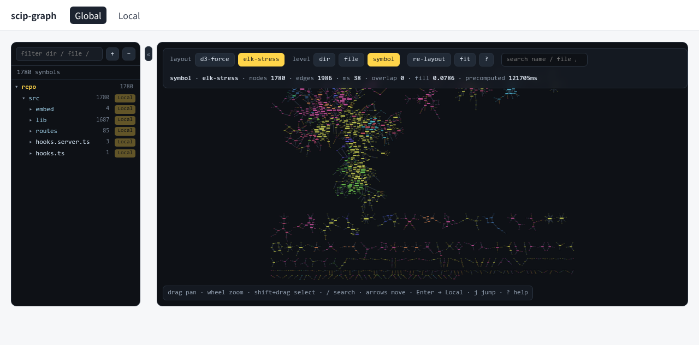

# Phase 6 (acceleration) — precomputed ELK stress layout

Scope: `scripts/precompute-elk.ts`, `src/lib/global/rect-separation.ts`,
`src/lib/global/elk-stress.ts`, `src/lib/server/loadGraph.ts`,
`src/routes/global/**`. The Local view (`src/routes/local/**`,
`src/lib/local/**`) is untouched.

The original plan identified exactly one layout worth accelerating:

> only `elk-stress` (74 s, single-threaded GWT) is worth accelerating; `d3-force`
> already runs in a Web Worker in ~6 s and does not need WASM.

Phase 6 brings back the offline `elk-stress` "clean skeleton" as a
**precomputed static layout**: run ELK once in Node, then load the result in the
browser instantly. No WASM, no `worker_threads` rewrite — both are dead ends
(see §4).

## 1. Pipeline

```
static/graph.json
  └─ aggregate(graph, 'symbol')                 (src/lib/global/aggregate.ts)
       └─ ELK `stress` layout                   (elkjs, devDependency)
            └─ deterministic rect-separation    (src/lib/global/rect-separation.ts,
                                                 the exact code the worker uses)
                 └─ static/elk-stress-symbol.json
```

`bun run precompute:elk` (= `bun scripts/precompute-elk.ts`) writes:

```jsonc
{
  "level": "symbol",
  "ms": 121705,            // offline ELK compute + cleanup wall time
  "cleanupPasses": 4394,
  "positions": [{ "id": "src/embed/index.ts:35", "x": …, "y": …, "w": …, "h": … }]
}
```

`x`/`y` is the **centre** of the drawn rectangle and `w`/`h` are its full
extents, i.e. exactly the `aggregate` node convention (`x`,`y`, `2*hw`, `2*hh`).
The file is derived and graph-specific → `.gitignore`d (`/static/elk-stress-symbol.json`).
`bun run precompute:elk -- --check` re-validates an existing file (count + zero
overlap) without recomputing.

## 2. Measured numbers (1780 symbol nodes, 1986 edges)

| step | where | wall time |
| --- | --- | --- |
| ELK `stress` layout | Node, offline | **104 778 ms** |
| rect-separation cleanup (4394 passes) | Node, offline | **16 927 ms** |
| **precompute total** | `bun run precompute:elk` | **121 705 ms** (~122 s), file 210 KiB |
| d3-force symbol layout | browser Web Worker | **6 466 ms** |
| **elk-stress load** | browser main thread | **38 ms** (map positions + re-derive overlap/fill metrics) |
| d3-force `dir` layout | browser Web Worker | 46 ms |

Quality on the same graph (metrics re-derived on the main thread with
`src/lib/global/metrics.ts`, not trusted from the file):

| layout | `nodeOverlapRatio` | `fillNet` |
| --- | --- | --- |
| d3-force symbol | 0 | 0.248 |
| **elk-stress symbol** | **0** | **0.079** |

ELK stress is a cleaner but looser skeleton (lower fill = more whitespace),
which is the expected trade-off of the "clean skeleton" mode. Overlap is 0 in
both — the hard metric is preserved.

Selection flow: the global toolbar gains a `layout` group, `d3-force` (live
worker, default) vs `elk-stress` (offline). Selecting `elk-stress` forces
`symbol` level, applies the precomputed positions without touching the worker,
and recomputes overlap/fill locally. The existing d3-force path is unchanged
(same worker, same params, same metrics).

### Cleanup pass count

ELK stress respects node sizes but still leaves a small number of drawn-rect
overlaps (670 pairs in the raw output here). The worker's `separateRects` is
capped at 250 passes, which is enough for d3-force but not for the ELK output;
the precompute therefore runs the **same function** in 500-pass rounds until
clean (4394 passes, ~17 s), hard-capped at 20 000 passes so a pathological graph
cannot hang. The worker itself is untouched (`maxPasses = 250`).

## 3. Fallback / failure behaviour

- **File absent** (`bun run precompute:elk` not run): `loadElkStress()` returns
  `null`, the `elk-stress` button is `disabled` with the hint
  *“precomputed layout missing — run bun run precompute:elk”*, and the view stays
  on the live d3-force worker.
- **File stale** (regenerated graph, old positions): `elkCovers()` requires a
  position for *every* symbol node and an exact count match. A mismatch switches
  back to `d3-force` and shows a toast *“precomputed elk-stress layout is stale
  — run bun run precompute:elk”*.
- **Corrupt file**: the server loader throws on a schema mismatch rather than
  serving a broken layout.

## 4. What was deliberately **not** accelerated

1. **A WASM/parallel ELK rewrite.** ELK.js is GWT-compiled Java→JavaScript
   (`lib/elk-worker.min.js`, a browserified fake worker). Upstream ships no WASM
   build, and the GWT output is not structured for an incremental/parallel
   port. Compiling ELK's Java to WASM would be a large, high-risk project for a
   layout that is a *one-shot offline* step — the precompute already turns the
   74 s cost into an instant load.
2. **`worker_threads` splitting of the stress layout.** The stress algorithm is
   a *whole-graph* optimisation: every node position depends on the global
   shortest-path / stress matrix, so there is no clean partition to hand to
   separate threads. Splitting would need cross-thread synchronisation per
   iteration and would change the deterministic result, with little speedup.
   `elkjs`' own fake worker is single-threaded anyway.
3. **`d3-force`.** It already runs off the main thread in `layout.worker.ts`
   (~6.5 s for 1780 symbols) and its result is interactive/seedable. Phase 6
   leaves that path byte-for-byte unchanged; only the offline option is added.

## 5. Verification

```bash
bun run precompute:elk                 # ~122 s, writes static/elk-stress-symbol.json
bun run precompute:elk -- --check      # 1780 positions, overlap 0, fill 0.0786
bun run check && bun test && bun run build
bun run dev -- --port 8173
```

In the browser (devtools or the `window.__global` handle):

```js
window.__global.setLayoutMode('elk-stress'); // or click the toolbar button
window.__global.metrics();
// { level: 'symbol', source: 'elk-stress', ms: 38, nodeOverlapRatio: 0,
//   nodeOverlapPairs: 0, precomputedMs: 121705, … }
```



Screenshot: `docs/shots/p6-elk-stress.png` — toolbar shows `layout: elk-stress`,
`level: symbol`, and the metrics line `overlap 0 · precomputed 121705ms`.
