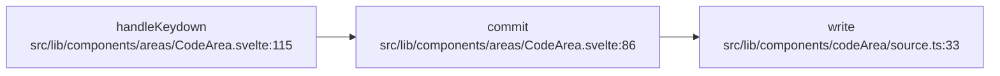

# 查询 CLI 验证记录（`feat/query-cli`）

对真实 fork 索引与派生图跑一遍的实测滚动记录。所有命令在 `scip-graph/` 仓库根执行。

## 0. 准备数据

```bash
bun run derive -- \
  --scip /home/n/document/code/gpen/gpen-js/rules/out/.cache/scip/index-fork.json \
  --out static/graph.json
```

```
[scip-graph] wrote static/graph.json from .../index-fork.json
{
 "nodes": 1780, "edges": 2001, "self_loops": 15,
 "svelte_nodes": 414, "svelte_edges": 559,
 "virtual_edges": 303, "call_sites": 2196,
 "kinds": { "Function": 907, "Other": 234, "Method": 228, "Unknown": 195,
            "Constant": 98, "Property": 85, "Module": 24, "Constructor": 8, "Class": 1 }
}
```

> `static/graph.json` 在 `.gitignore` 中，属生成产物。`boundaries` 的 `--index`
> 默认 `rules/out/.cache/scip/index-fork.json`（cwd 相对）；本仓库没有 gpen-js 的
> `rules/` 目录，验证时用 `--index` 指向 gpen-js 的索引。

## 1. `callers` — Q3 对齐

```bash
bun src/bin/scip-graph.ts callers "src/lib/components/areas/CodeArea.svelte:86" --json
```

- **`count = 2`**：`CodeArea.svelte:86`（`commit`，distance 0）+ **`CodeArea.svelte:115`**
  （`handleKeydown`，distance 1）。
- 边：`CodeArea.svelte:115 → CodeArea.svelte:86`（`dispatch: "static"`, `calls: 1`）。

## 2. `refs` — 调用点

```bash
bun src/bin/scip-graph.ts refs "src/lib/components/areas/CodeArea.svelte:86" --json
```

- **`count = 2`**。
- 入站 1 条：`handleKeydown` `CodeArea.svelte:115`，site **`CodeArea.svelte:119:2`**（static）。
- 出站 1 条：`write` `src/lib/components/codeArea/source.ts:33`，site **`CodeArea.svelte:91:11`**（virtual）。

## 3. `boundaries` — 未解析 callee

```bash
bun src/bin/scip-graph.ts boundaries \
  --index /home/n/document/code/gpen/gpen-js/rules/out/.cache/scip/index-fork.json --json
```

- **`count = 4145`**。
- `breakdown.byKind` = **`{ "builtins": 2931, "runes": 948, "node_modules": 266 }`**（无 unclassified）。
- Top callee：`$state×456, String×407, $derived×220, Error×186, $effect×144, …`。
- 过滤示例：`--symbol '$derived'` → `count = 220`（全部 runes）。
- 缺索引时 `--index /nope/missing.json` → **退出码 3** + 空 `--json` 信封（`reason: "index-missing:…"`）。

## 4. 导出：mermaid / dot

```bash
bun src/bin/scip-graph.ts impact "src/lib/components/areas/CodeArea.svelte:86" \
  --depth 2 --format mermaid --out /tmp/q3.mmd     # 退出码 0
```

`/tmp/q3.mmd`：

````

````

- 结构校验：首行 ` ```mermaid `、次行 `flowchart LR`、末行 ` ``` `，**3 个节点 / 2 条边**；
  `mmdc` 不可用（`command not found`），故用脚本做结构校验（通过）。

```bash
bun src/bin/scip-graph.ts impact "src/lib/components/areas/CodeArea.svelte:86" \
  --depth 2 --format dot --out /tmp/q3.dot          # 退出码 0
dot -Tsvg /tmp/q3.dot -o /tmp/q3.svg                # graphviz 14.1.4：成功，3010 B SVG
```

## 5. 退出码

| 场景                         | 命令                                                        | 退出码 |
| ---------------------------- | ----------------------------------------------------------- | ------ |
| 成功                         | `callers <file:line> --json`                                | 0      |
| 选择器未命中 / 歧义          | `callers does::not::exist` / `callers commit`（5 个 commit）| 1      |
| 用法错误                     | `frobnicate` / `--depth -1` / `refs <file>`（多节点）        | 2      |
| 边界索引缺失                 | `boundaries --index /nope/missing.json`                     | 3      |

## 6. 自测 / 静态检查 / 构建

```bash
bun test
# 11 pass / 0 fail, 43 expect() calls

bun run check
# svelte-check found 0 errors and 0 warnings

bun run build
# ✓ built in 2.57s   (@sveltejs/adapter-auto)
```

`bun test` 覆盖选择器（精确 / 文件 / glob / 名称精确→子串 / 歧义）、BFS（深度 0、环终止、
callers 方向）、refs 分组、boundaries（scoped 解析 + 四类分类 + breakdown + 过滤）、
mermaid/dot 结构，以及 `runCli` 的 0/1/2/3 退出码。
